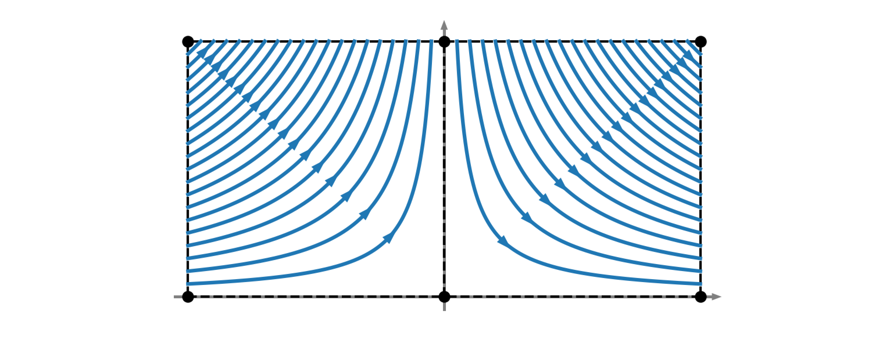

# C-grid interpolation: motivation and introduction

In [Delandmeter & van Sebille, 2019](https://www.geosci-model-dev.net/12/3571/2019/), we developed a specific interpolator for C-grids. The construction of this interpolator in 2D and 3D grids, for rectilinear and curvilinear meshes, is described in the paper and implemented in the [Parcels code](http://www.oceanparcels.org) and this [repository](https://github.com/OceanParcels/parcels_cgrid_interpolation_schemes).

In this notebook, we develop the motivation to this approach, showing why a specific interpolator is necessary for C-grids, using a simple benchmark.

## Benchmark: conservative analytical flow

Let's define the simple flow:

$$
\begin{cases}
u &= |x|\\
v &= -y \: \text{sign}(x),
\end{cases}
$$

for wich the continuity equation $u_x + v_y = 0$ holds.

To visualize the flow, let's integrate the trajectory of 40 particles (Fig. 1)

![Analytical flow on the domain [-1:1]x[0:1]](c_grid_motivation/pics/two_jets_analytical_cropped.png)

### A-grid interpolation

Let's now interpolate the field on an A-grid. To do so, we mesh the domain into 2 cells with $dx=1$. One cell for negative $x$ and the other cell for positive $x$.

The field discretised on the A-grid (with nodes in black on Fig. 2) is interpolated following Eq. 1 of the paper. Integrating the particles on the discretised field leads to a perfect trajectory:

It is not coincidence that the particles are perfectly integrated, even on a coarse mesh. This results from the original flow which is bi-linear, such as the A-grid interpolator.

